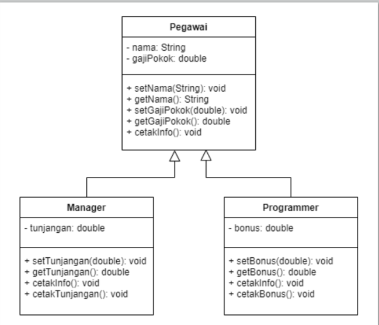
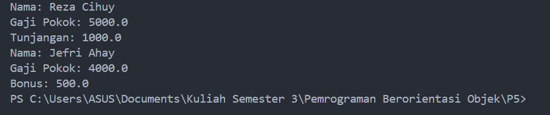

# Inheritance


## Latihan
• Lengkapi latihan class
Mahasiswa dengan
setter dan getter. <br>
• Implementasikan java
code diagram class
berikut : <br> <br>



<br>

<b>1. Kelas Pegawai (Superclass/Parent Class) </b> <br>
Kelas ```Pegawai``` adalah kelas dasar (parent class) yang menjadi induk dari kelas ```Manager``` dan ```Programmer```. Kelas ini memiliki atribut dasar yang dimiliki oleh semua pegawai, yaitu ```nama``` dan ```gajiPokok```. <br>

<b>Atribut : </b> <br>

```nama``` : Tipe data ```String```, digunakan untuk menyimpan nama pegawai.
```gajiPokok``` : Tipe data ```double```, digunakan untuk menyimpan gaji pokok pegawai. <br> <br> 


  <b>Metode Setter dan Getter :</b>

  Setter : <br>
  ```setNama(String nama)``` : Digunakan untuk menetapkan nama pegawai.
  ```setGajiPokok(double gajiPokok)``` : Digunakan untuk menetapkan gaji pokok pegawai. <br>

  Getter : <br>
  ```getNama()``` : Mengembalikan (return) nilai nama pegawai.
  ```getGajiPokok()``` : Mengembalikan (return) nilai gaji pokok pegawai. <br>
  
  Metode cetakInfo: Metode ini digunakan untuk mencetak informasi pegawai, seperti nama dan gaji pokoknya. Ini adalah metode umum yang dapat digunakan oleh semua jenis      pegawai. <br>

  ``` java
public void cetakInfo() {
    System.out.println("Nama: " + getNama());
    System.out.println("Gaji Pokok: " + getGajiPokok());
}
```
<br> <br>

<b>2. Kelas Manager (Subclass/Turunan dari Pegawai)</b> <br>
Kelas ```Manager``` adalah kelas turunan dari kelas ```Pegawai```. Artinya, ```Manager``` mewarisi semua atribut dan metode yang ada di ```Pegawai```, tetapi memiliki tambahan atribut dan metode yang spesifik untuk manajer. <br> <br>


<b>Atribut Tambahan : </b>

```tunjangan``` : Tipe data ```double```, digunakan untuk menyimpan tunjangan yang diterima oleh seorang manajer. <br> <br>


<b>Metode Setter dan Getter : </b>

Setter : <br>
```setTunjangan(double tunjangan)``` : Digunakan untuk menetapkan tunjangan manajer. <br>

Getter : <br>
```getTunjangan()``` : Mengembalikan nilai tunjangan manajer. <br>
```Metode cetakInfo``` : Metode ini me-override (menimpa) metode ```cetakInfo()``` dari kelas ```Pegawai```. Pertama, metode ini memanggil ```cetakInfo()``` dari kelas Pegawai (menggunakan ```super.cetakInfo())```, kemudian menambahkan informasi tunjangan yang spesifik untuk manajer.

``` java
@Override
public void cetakInfo() {
    super.cetakInfo();  // Memanggil metode dari kelas induk (Pegawai)
    System.out.println("Tunjangan: " + getTunjangan());
}
```
<br> <br>


<b>3. Kelas Programmer (Subclass/Turunan dari Pegawai)</b> <br>
Kelas ```Programmer``` juga merupakan kelas turunan dari kelas ```Pegawai```. Kelas ini memiliki struktur yang mirip dengan Manager, tetapi perbedaannya adalah programmer memiliki atribut tambahan bonus. <br>

<b>Atribut Tambahan :</b>

bonus : Tipe data double, digunakan untuk menyimpan bonus yang diterima oleh programmer. <br> <br>


<b>Metode Setter dan Getter :</b>

Setter : <br>
setBonus(double bonus) : Digunakan untuk menetapkan bonus programmer.

Getter : <br>
getBonus() : Mengembalikan nilai bonus programmer.
Metode cetakInfo: Mirip dengan kelas Manager, metode ini juga me-override metode cetakInfo() dari kelas Pegawai dan menambahkan informasi bonus yang spesifik untuk programmer. <br>

```java
@Override
public void cetakInfo() {
    super.cetakInfo();  // Memanggil metode dari kelas induk (Pegawai)
    System.out.println("Bonus: " + getBonus());
}
```
<br> <br>

<b>4. Kelas Main (Untuk Pengujian)</b> <br>
Kelas Main adalah kelas utama yang digunakan untuk menjalankan program dan menguji kelas-kelas yang telah kita buat. Dalam kelas ini, kita membuat objek dari kelas ```Manager``` dan ```Programmer```, lalu menggunakan metode-metode yang sudah didefinisikan untuk menetapkan nilai-nilai atribut dan mencetak informasi masing-masing pegawai. <br>

Membuat objek ```Manager``` dan ```Programmer```.<br>
Menetapkan nilai ```nama```, ```gajiPokok```, ```tunjangan``` (untuk manajer), dan ```bonus``` (untuk programmer). <br>
Memanggil metode ```cetakInfo()``` untuk mencetak informasi lengkap dari objek-objek tersebut. <br>

``` java
public class Main {
    public static void main(String[] args) {
        // Membuat objek Manager
        Manager manager = new Manager();
        manager.setNama("Reza Cihuy");
        manager.setGajiPokok(5000);
        manager.setTunjangan(1000);
        manager.cetakInfo();

        // Membuat objek Programmer
        Programmer programmer = new Programmer();
        programmer.setNama("Jefri Ahay");
        programmer.setGajiPokok(4000);
        programmer.setBonus(500);
        programmer.cetakInfo();
    }
}
```
<br> <br>

### Dan ini adalah hasil outputnya


<b>Kesimpulan</b> <br>
<b>Inheritance (Pewarisan)</b> : ```Manager``` dan ```Programmer``` mewarisi atribut dan metode dari kelas ```Pegawai```. Ini berarti kedua kelas tersebut bisa menggunakan metode yang ada di kelas ```Pegawai```, dan mereka juga dapat menambahkan atribut/metode spesifik masing-masing. <br>

<b>Polymorphism (Polimorfisme)</b> : Kelas ```Manager``` dan ```Programmer``` memanfaatkan konsep polymorphism dengan meng-override metode ```cetakInfo()``` dari kelas ```Pegawai```, sehingga mereka dapat menampilkan informasi yang lebih spesifik (seperti tunjangan untuk manajer dan bonus untuk programmer). <br>

<b>Encapsulation (Enkapsulasi)</b> : Atribut-atribut dalam semua kelas bersifat ```private```, yang melindungi akses langsung dari luar kelas. Akses terhadap atribut tersebut dilakukan melalui metode setter dan getter, sesuai dengan prinsip enkapsulasi. <br>
